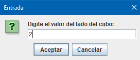
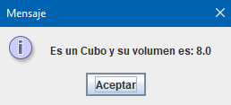
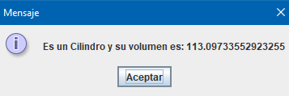
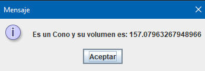
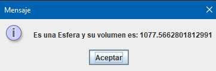
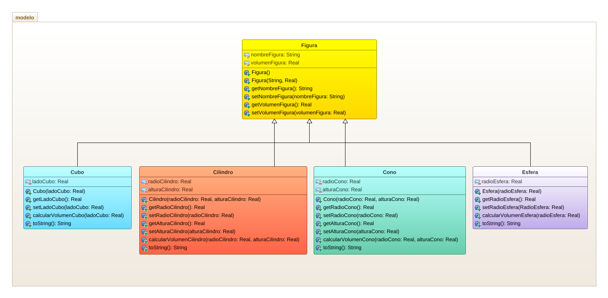

## EJERCICIO PRÁCTICO PARCIAL FINAL POO
Elaborar un programa que ofrezca un menú de opciones mediante el cual se pueda escoger calcular el volumen de las figuras geométricas: cubo, cilindro, cono y esfera. Una vez seleccionada la opción, que permita solicitar y leer el nombre de la figura y los datos necesarios para calcular el volumen correspondiente e imprima el nombre de la figura y el volumen. Debe usarse una superclase Figura y una subclase para casa una de las figuras indicadas.

## PANTALLAZOS DEL PROGRAMA EN EJECUCCIÓN

## DIAGRAMA DE CLASES

